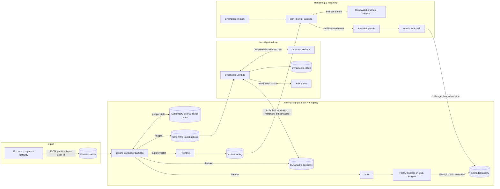

# RADAR — Real-time Agentic Detection and Reporting

*Real-time fraud detection with an agentic investigation layer, on AWS.*
Repository: https://github.com/thechiragbatra/radar-fraud · Author: Chirag Batra

| | |
|---|---|
| Synthetic transactions | 606k over 90 days, 15k users, 0.7% fraud across six patterns |
| Detection | XGBoost: 89.6% recall at 1% FPR (hand-written rules 66.8%, logistic regression 73.7%) |
| Scoring service | 0.4 ms median server-side; 717 req/s at p95 63 ms in the load test |
| Investigation agent | Bedrock tool-use loop with schema-validated verdicts; heuristic baseline decides 59% of cases at 83.1% accuracy |
| Engineering | 42 tests, ~60 AWS resources in Terraform, CI + OIDC deploy |

**Contents:** [README](#readme) · [Architecture](#architecture) · [Model report](#model-report) · [Investigation reports](#investigation-reports) · [Agent evaluation](#agent-evaluation) · [Design decisions](#design-decisions) · [Repository files](#repository-files)

---

## README

A production-shaped fraud detection system: transactions are scored on a stream in under a
millisecond server-side, the model watches its own feature drift and retrains champion/challenger
style, and every flagged transaction is investigated by an LLM agent that gathers evidence with
tools and commits a schema-validated verdict. Infrastructure is Terraform, delivery is GitHub
Actions, and both the model and the agent are evaluated against baselines on held-out data.

```
Kinesis ──► Lambda (features from DynamoDB state) ──► FastAPI/XGBoost on Fargate ──► decisions, feature log
                                                              │
                                   flagged ──► SQS ──► Lambda + Bedrock agent (tools) ──► verdict, report, alert
                                                              │
      S3 feature log ──► hourly PSI drift monitor ──► EventBridge ──► retrain task ──► promote if better ──► hot-swap
```

Full diagram and walkthrough: [docs/architecture.md](#architecture). Full model report: [docs/model-report-v1.md](#model-report).

### Results

Dataset: 606k synthetic transactions over 90 days for 15k users, 0.7% fraud across six injected
patterns, plus the legitimate behaviours that make fraud detection hard (trips, phone upgrades,
sale-day sprees, bill-pay bursts, night owls, shared family phones). Time-based split; threshold
chosen on validation at a 1% false-positive target; everything below is on the untouched 14-day
test window (81k transactions, 608 fraud).

| model | ROC-AUC | PR-AUC | recall @ 0.5% FPR | recall @ 1% FPR | recall @ 2% FPR | deployed operating point | precision | alerts/day |
|---|---|---|---|---|---|---|---|---|
| hand-written rules | 0.814 | 0.301 | 66.8% | 66.8% | 66.8% | 66.8% @ 5.89% FPR | 7.9% | 369 |
| logistic regression | 0.956 | 0.676 | 69.4% | 73.7% | 77.0% | 73.7% @ 0.96% FPR | 36.7% | 87 |
| **XGBoost** | **0.982** | **0.882** | **88.0%** | **89.6%** | **91.6%** | **89.6% @ 0.99% FPR** | **40.6%** | **96** |

Recall by fraud pattern at the deployed threshold: account takeover 100%, card testing 100%,
geo jump 100%, low-and-slow 97.9%, merchant collusion 61.8%, velocity burst 61.4%. The two weak
patterns are the ones with no device or location signal - exactly where the investigation layer
earns its place.

False positives by legitimate behaviour (test window): travellers are flagged 6x more often than
regular transactions (3.2% vs 0.5%), sale-day sprees 2.6x, phone upgrades 2.3x.

Scoring service: 0.4 ms median server-side, ~1.5 ms when SHAP reasons are computed for a flagged
transaction; 717 req/s with p95 63 ms end to end on two uvicorn workers in the load test
([loadtest/README.md](https://github.com/thechiragbatra/radar-fraud/blob/main/loadtest/README.md)).

Investigation agent, heuristic baseline on 100 labelled cases (50 fraud, 50 false positives):
decides 59% of cases, 83.1% accurate when it does, 7 false blocks, 3 missed frauds, 7 tool calls
per case, 40 ms. The LLM column fills in when you run `make eval-bedrock` with your own account —
[evals/README.md](#agent-evaluation).

> These numbers are properties of a simulator built to be adversarial (see
> [docs/decisions.md](#design-decisions)).
> What transfers to real data is the methodology, the gaps between models, and the failure analysis.

### What is in the box

| area | what | where |
|---|---|---|
| Simulator | users, merchants, devices; six fraud patterns; hard-negative legit behaviours; deterministic | `src/radar/simulator/` |
| Features | 45 causal features from bounded per-user/device rolling state; one code path for training and serving; in-memory and DynamoDB stores | `src/radar/features/` |
| Model | XGBoost with time-based split, burn-in, imbalance handling, rules + LR baselines, recall@FPR, per-pattern recall, SHAP, PSI reference, case bank; registry with champion pointer; champion/challenger retrain | `src/radar/model/` |
| Scoring service | FastAPI; hot-swaps the champion from S3; SHAP reasons only for flagged; Prometheus metrics | `src/radar/scoring/` |
| Stream path | Kinesis consumer Lambda with partial-batch failures, Firehose feature log, FIFO queue for flagged | `src/radar/lambdas/` |
| Agent | Bedrock Converse tool-use loop with allow-list, argument validation, step/token budgets, structured verdict; heuristic baseline backend; analyst report | `src/radar/agent/` |
| Drift | PSI per feature and on the score vs frozen training bins; CloudWatch metrics; EventBridge trigger | `src/radar/model/drift.py`, `lambdas/drift_monitor.py` |
| Evals | stratified 100-case set; coverage / decided accuracy / false blocks / missed fraud / cost; backend comparison | `src/radar/evals/`, `evals/` |
| Infra | VPC, Kinesis, Firehose, DynamoDB x3, SQS FIFO + DLQ, SNS, S3, ECR, ECS Fargate + ALB + autoscaling, 3 Lambdas, EventBridge, CloudWatch alarms + dashboard, IAM | `infra/terraform/` |
| Delivery | CI (ruff, pytest, terraform validate, docker build); OIDC deploy (ECR push, terraform apply, smoke test) | `.github/workflows/` |
| Tests | 42 tests: simulator invariants, feature math, no train/serve skew, model artefacts, API contract and hot-swap, consumer end-to-end on moto, agent guardrails, drift, eval harness | `tests/` |

### Run it locally (no AWS needed)

```
pip install -e ".[dev]"
make simulate        # 606k transactions, ~20 s
make train           # trains, evaluates, prints the report, promotes v1 (~1 min)
make test            # 42 tests
make demo            # streams 3000 transactions through the real scoring path and investigates the flags
make serve           # scoring API on :8000  ->  curl localhost:8000/health
radar-investigate --random-flagged 3        # full investigation report for three flagged transactions
```

`make demo` output looks like this:

```
  FLAG T000604166 score=0.847 Rs    3,087 utilities    [device_user_age_days=4.91, device_user_count=7, hour_local=17.2]  -> FRAUD/low_and_slow
  FLAG T000606206 score=0.137 Rs    2,208 ecommerce    [hour_local=23, seconds_since_last=664, device_user_age_days=89.2]  -> legit/sale_spree

3,000 scored in 3.2s | flagged 10 (0.33%) | end-to-end latency p50 0.5 ms p95 0.8 ms (feature store + score + SHAP for flagged)
flagged: 3 fraud, 7 false positives | fraud in window: 3

  [ok ] T000604166 verdict=fraud        conf=0.95 action=block_card_and_contact_customer  truth=FRAUD/low_and_slow
        device has 25 confirmed fraud transactions
  [BAD] T000603411 verdict=fraud        conf=0.81 action=block_card_and_contact_customer  truth=legit/big_purchase
        amount Rs16,891 is 18.0x the account's 2-week median Rs939
  [?  ] T000605224 verdict=needs_review conf=0.50 action=step_up_authentication           truth=legit/regular
        71% of the most similar resolved cases were fraud
```

The `[BAD]` line is the point of the evaluation harness: the rule-based investigator blocks a
customer for a Rs 16,891 travel booking from a two-day-old device. The account's history shows
an Rs 11,779 electronics purchase on the old phone two days earlier, followed by small food
orders from the new one - a phone upgrade. An LLM agent that reads the history is expected to
send this to review rather than block it; the eval harness measures whether it does.

### Deploy to AWS

[docs/runbook.md](https://github.com/thechiragbatra/radar-fraud/blob/main/docs/runbook.md) — Terraform apply, image push, bootstrap, traffic replay,
forcing a drift event, cost (~$60/month while running, near zero when stopped), tear-down.

For a hosted scoring API without AWS, see the [Render deployment setup](radar/README.md#deploy-the-scorer-on-render).

### Repository layout

```
src/radar/
  simulator/   world.py, fraud_patterns.py, generate.py, producer.py
  features/    state.py, store.py, reference.py, engineering.py
  model/       train.py, evaluate.py, drift.py, registry.py, retrain.py
  scoring/     scorer.py, api.py
  agent/       investigator.py, tools.py, llm.py, datasource.py, prompts.py, report.py, cli.py
  lambdas/     stream_consumer.py, investigate.py, drift_monitor.py, common.py
  evals/       harness.py
infra/terraform/   providers, variables, vpc, storage, iam, ecs, lambda, monitoring, outputs
docker/            Dockerfile.scorer, Dockerfile.lambda
.github/workflows/ ci.yml, deploy.yml
tests/             42 tests
docs/              architecture.md, decisions.md, runbook.md, interview-notes.md
evals/             cases/, results/, README.md
loadtest/          locustfile.py, results/
scripts/           local_stream_demo.py, bootstrap_aws.py
```

### Roadmap

* Graph features over the user–device–merchant graph for ring detection (today approximated by
  device sharing counts)
* Merchant fraud rate as a time-lagged rolling feature instead of a static category prior
* Label feed from the cases table + chargebacks into retraining; analyst feedback on agent verdicts
  as a second evaluation signal
* Production hardening: private subnets + internal ALB + VPC endpoints, HTTPS, per-tenant API keys
* Streaming feature computation in Flink (Kinesis Data Analytics) if volume outgrows one Lambda per shard

### Licence

MIT

---

## Architecture

RADAR (Real-time Agentic Detection and Reporting) has three loops running at different speeds:

| loop | cadence | what it does |
|---|---|---|
| **scoring** | per transaction, < 100 ms | features from rolling state, model score, decision persisted, flagged ones queued |
| **investigation** | per flagged transaction, seconds | LLM agent gathers context with tools, commits a validated verdict, analyst report + alert |
| **monitoring & retraining** | hourly / on drift / weekly | PSI drift on live features, champion/challenger retrain, hot-swap promotion |



### Scoring path, step by step

1. **Producer** (`radar-produce`) replays `transactions.parquet` onto Kinesis. The wire record is
   the `Transaction` schema - no labels. Partition key is `user_id`, which gives per-user ordering.
2. **stream_consumer** reads a batch, and for each record:
   - loads `UserState` and `DeviceState` from DynamoDB (one `GetItem` each, consistent read),
   - computes the 45 features in `features/engineering.py` from the state *before* this transaction,
   - calls `POST /score` on the Fargate service (keep-alive HTTP client, 2 s timeout),
   - writes the decision (score, flag, SHAP reasons, feature vector, raw txn) to the decisions table
     with a 30-day TTL, and the feature vector to Firehose for drift monitoring,
   - if flagged, sends `{txn_id, user_id, score}` to the FIFO investigations queue,
   - folds the transaction into the state and writes it back.
   Failures are reported per record (`ReportBatchItemFailures`) with bisecting retries and an
   on-failure SQS destination, so one poison record cannot stall the shard.
3. **Scorer** keeps the champion `ModelBundle` in memory, polls `champion.json`'s ETag every 60 s
   and swaps the model without a redeploy. SHAP is computed only for flagged transactions
   (about 1% of traffic) to keep the median under a millisecond.

### Feature engineering without train/serve skew

The same `compute_features(txn, user_state, device_state, profile, merchant)` function runs in
training (replaying history through an in-memory store in time order) and in serving (DynamoDB
store). State is bounded (24 h recent window, capped sets) so a DynamoDB item stays small, and
every feature is causal: it only uses what was known before the transaction's timestamp.

Feature groups: amount vs the user's running mean/std (Welford), velocity (1 h / 24 h counts and
sums, sub-Rs100 count), device novelty and sharing (`device_user_age_days`,
`device_user_count`), geography (distance and implied speed since the previous transaction,
home-city, international), time of day in IST, static merchant risk prior and age, channel and
category one-hots.

### Investigation agent

`agent/investigator.py` runs a Bedrock Converse loop with seven tools. Six are read-only
look-ups over the decisions/state tables (the LLM never writes); the seventh, `submit_verdict`,
is the only way to finish and its payload is validated against `InvestigationResult`. Guardrails:
tool allow-list, pydantic validation of every argument, step and token budgets, bounce-back of
invalid verdicts, and `needs_review` as the fail-safe outcome. The heuristic backend drives the
same loop with a fixed plan and hand-written rules and is the baseline in `evals/`.

### Drift and retraining

At training time `reference.json` freezes decile bins for every feature and for the score. Every
hour the drift monitor bins the last 24 h of the feature log with the same edges and computes PSI
per feature; results go to CloudWatch (`RADAR/FeaturePSI`, `MaxPSI`) and, above 0.2, an
EventBridge `DriftDetected` event starts the retraining task. The task trains a challenger on the
latest window, evaluates the current champion on the same held-out window at the same target FPR,
and promotes only on a material recall gain without a PR-AUC regression. Every decision is written
to `models/decisions/` for audit.

### Why these services

| need | choice | alternative considered |
|---|---|---|
| ordered, replayable stream | Kinesis (1 shard = 1 MB/s in, 1000 rec/s) | MSK (Kafka): more ops, more cost for this scale |
| per-user state, ms reads | DynamoDB on-demand | ElastiCache Redis: lower latency but needs a VPC/NAT and no persistence by default |
| scoring service | Fargate + ALB | model inside the Lambda (supported via `RADAR_SCORER_URL=local`): fewer hops, but no independent scaling, no shared endpoint for synchronous callers |
| long-running training | ECS Fargate task | Lambda: 15-min limit; SageMaker: heavier and not free-tier friendly |
| LLM | Bedrock Converse | direct Anthropic API: fine, but Bedrock keeps data in-account and under IAM |
| infra | Terraform | CDK/SAM: fine too; Terraform is the common denominator across clouds |

Deeper rationale and rejected options: [decisions.md](#design-decisions).

---

## Model report

Generated by `make train` (version v1). Threshold chosen on validation at a 1% false-positive target; all metrics on the untouched 14-day test window.

Trained 2026-10-03T17:20:18.835234+00:00. Rows: {'train': 357452, 'val': 58376, 'test': 81332}. Target FPR 1.0% (threshold 0.1211 chosen on validation, metrics below are on the untouched test window).

| model | ROC-AUC | PR-AUC | recall@0.5%FPR | recall@1%FPR | recall@2%FPR | deployed op. point | precision | alerts/day |
|---|---|---|---|---|---|---|---|---|
| rules | 0.814 | 0.301 | 66.8% | 66.8% | 66.8% | 66.8% @ 5.89% FPR | 7.9% | 369 |
| logistic_regression | 0.956 | 0.676 | 69.4% | 73.7% | 77.0% | 73.7% @ 0.96% FPR | 36.7% | 87 |
| xgboost | 0.982 | 0.882 | 88.0% | 89.6% | 91.6% | 89.6% @ 0.99% FPR | 40.6% | 96 |

### Recall by fraud pattern (XGBoost, deployed threshold)

| pattern | n | recall |
|---|---|---|
| account_takeover | 90 | 100.0% |
| card_testing | 272 | 100.0% |
| geo_jump | 37 | 100.0% |
| low_and_slow | 48 | 97.9% |
| merchant_collusion | 34 | 61.8% |
| velocity_burst | 127 | 61.4% |

### Top features by mean |SHAP|

| feature | mean abs SHAP |
|---|---|
| device_user_age_days | 0.8898 |
| seconds_since_last | 0.4487 |
| hour_local | 0.3123 |
| speed_kmh | 0.2523 |
| amount | 0.2356 |
| channel_card | 0.2104 |
| device_age_days | 0.2009 |
| is_online | 0.1936 |
| txn_count_1h | 0.1886 |
| amount_ratio_mean | 0.1325 |
| category_risk | 0.1309 |
| amount_sum_24h | 0.1258 |
| is_home_city | 0.1227 |
| txn_count_total | 0.1049 |
| cat_grocery | 0.0951 |

---

## Investigation reports

What an analyst receives for a flagged transaction: verdict, confidence, evidence, recommended action and the full tool trail. Produced by `radar-investigate` with the rule-based baseline backend; the Bedrock agent produces the same structure with a reasoned summary.

> **True fraud.** Low-and-slow attack from a ring device; verdict and action are correct. Ground truth: FRAUD (low_and_slow)

### Investigation case_2ccd9392c8 - transaction T000604166

**Verdict:** FRAUD  ·  **Confidence:** 95%  ·  **Pattern:** none  ·  **Action:** Block instrument and contact customer

### Summary

Transaction T000604166 of Rs3,087 at a utilities merchant scored 0.85. Evidence points: +6.0. Strongest signals: model score 0.85 is far above threshold 0.12; device has 25 confirmed fraud transactions; amount Rs3,087 is 3.8x the account's 2-week median Rs823. Verdict fraud (95%); recommended action: block card and contact customer.

### Key evidence

- model score 0.85 is far above threshold 0.12
- device has 25 confirmed fraud transactions
- amount Rs3,087 is 3.8x the account's 2-week median Rs823
- 100% of the most similar resolved cases were fraud

### Investigation trail

7 tool calls · 7 model turns · 1223 ms · 0 tokens · $0.0000 · heuristic (heuristic-v1 / prompt 2026-10-03.1)

| # | tool | arguments | ok |
|---|---|---|---|
| 1 | get_transaction | `txn_id=T000604166` | yes |
| 2 | get_user_profile | `user_id=U012033` | yes |
| 3 | get_user_transactions | `user_id=U012033, hours=336, limit=60` | yes |
| 4 | get_device_history | `device_id=DRING0086` | yes |
| 5 | get_merchant_profile | `merchant_id=M01492` | yes |
| 6 | find_similar_cases | `k=7` | yes |
| 7 | submit_verdict | `verdict=fraud, confidence=0.95, fraud_type=none, recommended_action...` | yes |

> **False positive.** A legitimate Rs 16,891 travel booking two days after a phone upgrade. The rule-based baseline blocks it; this is the case the LLM agent is expected to send to review instead. Ground truth: legit (big_purchase)

### Investigation case_7d1eb85840 - transaction T000603411

**Verdict:** FRAUD  ·  **Confidence:** 81%  ·  **Pattern:** none  ·  **Action:** Block instrument and contact customer

### Summary

Transaction T000603411 of Rs16,891 at a travel merchant scored 0.67. Evidence points: +3.0. Strongest signals: model score 0.67 is far above threshold 0.12; amount Rs16,891 is 18.0x the account's 2-week median Rs939. Verdict fraud (81%); recommended action: block card and contact customer.

### Key evidence

- model score 0.67 is far above threshold 0.12
- amount Rs16,891 is 18.0x the account's 2-week median Rs939

### Investigation trail

7 tool calls · 7 model turns · 42 ms · 0 tokens · $0.0000 · heuristic (heuristic-v1 / prompt 2026-10-03.1)

| # | tool | arguments | ok |
|---|---|---|---|
| 1 | get_transaction | `txn_id=T000603411` | yes |
| 2 | get_user_profile | `user_id=U010456` | yes |
| 3 | get_user_transactions | `user_id=U010456, hours=336, limit=60` | yes |
| 4 | get_device_history | `device_id=D010456an` | yes |
| 5 | get_merchant_profile | `merchant_id=M00745` | yes |
| 6 | find_similar_cases | `k=7` | yes |
| 7 | submit_verdict | `verdict=fraud, confidence=0.81, fraud_type=none, recommended_action...` | yes |

---

## Agent evaluation

100 labelled cases from the test window: 50 confirmed fraud (stratified across patterns) and 50 false positives (stratified across the legitimate behaviours that fooled the model). The LLM column appears after `make eval-bedrock` is run with an AWS account.

| metric | heuristic |
|---|---|
| coverage | 59.0% |
| decided_accuracy | 83.1% |
| fraud_recall | 64.0% |
| fraud_precision | 82.1% |
| false_blocks | 7 |
| missed_fraud | 3 |
| fraud_type_accuracy | 31.2% |
| avg_tool_calls | 7.0 |
| p50_latency_ms | 41 |
| avg_tokens | 0.0 |
| avg_cost_usd | $0.0000 |
| monthly_cost_usd_at_100_alerts_per_day | $0 |

### Decided accuracy by stratum

| stratum | n | heuristic |
|---|---|---|
| account_takeover | 9 | 100% (cov 89%) |
| card_testing | 9 | 100% (cov 100%) |
| geo_jump | 8 | 75% (cov 50%) |
| legit:big_purchase | 3 | 0% (cov 67%) |
| legit:phone_upgrade | 11 | 100% (cov 27%) |
| legit:regular | 12 | 60% (cov 42%) |
| legit:sale_spree | 12 | 25% (cov 33%) |
| legit:trip | 12 | 100% (cov 83%) |
| low_and_slow | 8 | 100% (cov 100%) |
| merchant_collusion | 8 | 100% (cov 38%) |
| velocity_burst | 8 | 33% (cov 38%) |

---

## Design decisions

Short ADR-style notes. Each one is a trade-off an interviewer can push on.

### 1. Time-based split with burn-in, not a random split

Random splits leak: a user's later transactions shape the feature store that scores their earlier
ones, and the same fraud episode lands in both train and test. The split is by time (train / 10-day
validation / 14-day test) and the first 14 days are replayed for state only. The operating threshold
is chosen on validation and *reported* on test, including the FPR it actually achieved (0.99% for a
1% target in the shipped model).

### 2. `scale_pos_weight` instead of SMOTE

SMOTE interpolates between fraud rows in feature space and produces transactions that never happen
(half-way between a card-testing burst and a geo-jump). Reweighting changes the loss, not the data.
We use `sqrt(neg/pos)` rather than the full ratio: the full ratio pushes scores up across the board
and makes the probability output useless for ranking alerts.

### 3. Recall at fixed FPR is the headline metric

Accuracy is 99.3% for a model that flags nothing. A fraud team cares about how much fraud is caught
when only 1 in 100 legitimate customers is bothered, and how many alerts that generates per analyst
per day. ROC-AUC and PR-AUC are reported for comparability, but the deployed threshold is a business
choice (1% FPR -> ~100 alerts/day at this volume).

### 4. Same feature code for training and serving

The alternative - a SQL/Spark feature pipeline offline and a hand-written one online - is where most
production fraud systems get train/serve skew. Here one Python function is called by both the
replay and the Lambda, and `tests/test_features.py::test_replay_has_no_leakage_and_matches_online_path`
asserts they agree row for row. The cost is a pure-Python replay (~50 us/row, 30 s for 600k rows),
which is fine at this scale and parallelisable by user if it is not.

### 5. DynamoDB as the online feature store, no locking

Kinesis partitions by `user_id`, Lambda runs one invocation per shard, so a user's records are
processed sequentially and the read-modify-write on `UserState` needs no lock. Device state can be
touched from two shards concurrently (two users sharing a device); we accept the rare lost update
because `device_user_count` is a soft signal. Redis would be faster but needs a VPC, a NAT or
endpoints, and persistence configuration; DynamoDB on-demand is single-digit ms and ~free at demo
volume.

### 6. Scoring service on Fargate vs model inside the Lambda

The model is small enough to load in the Lambda (`RADAR_SCORER_URL=local` does exactly that), and
that variant removes the ALB hop. We kept the service because (a) synchronous callers - a checkout
flow asking "should I step up auth?" - need an endpoint, (b) it scales on request rate independently
of the stream consumer, and (c) hot-swapping a model in one place is simpler than invalidating N
warm Lambdas. The hop costs ~5-15 ms inside a region.

### 7. Public ALB gated by a header, no NAT gateway

A NAT gateway is ~$32/month before data; interface endpoints for Kinesis, SQS, Firehose, Bedrock
and CloudWatch add ~$7/month each. For a demo that is the entire budget. Tasks run in public
subnets with a security group that only admits the ALB, and the ALB listener returns 403 unless
`x-radar-key` matches. Production hardening: private subnets, internal ALB, Lambdas in the VPC,
gateway endpoints (free) for S3/DynamoDB and interface endpoints for the rest, HTTPS with ACM.

### 8. PSI on features *and* on the score

Labels arrive late (chargebacks take weeks), so monitoring has to be label-free. Feature PSI catches
input shifts (a new merchant category, a payments outage changing velocity). Score PSI catches the
case where every feature looks stable but the model's output distribution moves - usually a sign of
a broken upstream field. Both use bins frozen at training time, so the comparison is always against
what the model actually learned on.

### 9. Champion/challenger with a one-sided promotion test

The challenger must gain at least +1 point of recall at 1% FPR *and* not lose PR-AUC. Silent
regressions cost more than missed gains, and retraining on a window that happens to contain an
easy fraud wave would otherwise promote a worse model. Every decision - promoted or not - is written
to the registry with both models' metrics, which is the audit trail a model-risk team asks for.

### 10. The agent finishes only through a validated tool call

Free-text verdicts need parsing, and parsing LLM output is where "it worked in the demo" dies. The
model must call `submit_verdict` with a payload that validates against `InvestigationResult`
(enum verdict, bounded confidence, 1-8 evidence strings, action enum, summary length). Invalid
payloads go back as tool errors with the validation message; after two retries the case is routed
to a human. The Lambda, not the model, decides what happens to the account.

### 11. A heuristic investigator as the baseline

An LLM agent that is 75% accurate sounds good until you learn six if-statements get 70%. The
heuristic backend drives the same tools with a fixed plan and rule-based scoring, so the comparison
is like for like: same cases, same tools, same output schema. It also doubles as a zero-cost
fallback if Bedrock is unavailable (`RADAR_BEDROCK_MODEL_ID=heuristic`).

### 12. Bedrock Converse directly, no agent framework

LangChain/LangGraph would add a dependency layer between us and the guardrails we need to reason
about (allow-list, retries, budgets). The Converse API already provides tool use with JSON schemas,
so the loop is ~120 lines we fully own and can unit-test with a scripted backend.

### 13. Synthetic data, and why the numbers are still meaningful

Real transaction data cannot be published. The simulator is built so that the model cannot win by
cheating: victims are drawn in proportion to activity (otherwise "low activity" leaks the label),
fraud multipliers are modest (1.2-4x, not 10x), legitimate life events (trips, phone upgrades,
sale-day sprees, bill-pay bursts, night owls, shared family phones) are the false-positive drivers
you see in production, and the hardest pattern (`low_and_slow`) stays inside the user's normal
spend. The absolute recall is a property of the simulator; the *gaps* - rules vs LR vs XGBoost,
per-pattern recall, which legit behaviours get flagged - are the transferable findings.

---

## Repository files

`data/` and `models/` are generated locally (`make simulate`, `make train`) and git-ignored.

```
radar/
├── .github/
│   └── workflows/
│       ├── ci.yml
│       └── deploy.yml
├── docker/
│   ├── Dockerfile.lambda
│   └── Dockerfile.scorer
├── docs/
│   ├── architecture.md
│   ├── decisions.md
│   ├── interview-notes.md
│   ├── model-report-v1.md
│   ├── runbook.md
│   └── shap-summary-v1.json
├── evals/
│   ├── cases/
│   │   └── cases.jsonl
│   └── README.md
├── infra/
│   └── terraform/
│       ├── envs/
│       │   └── dev.tfvars
│       ├── ecs.tf
│       ├── iam.tf
│       ├── lambda.tf
│       ├── monitoring.tf
│       ├── outputs.tf
│       ├── providers.tf
│       ├── storage.tf
│       ├── variables.tf
│       └── vpc.tf
├── loadtest/
│   ├── locustfile.py
│   └── README.md
├── scripts/
│   ├── bootstrap_aws.py
│   └── local_stream_demo.py
├── src/
│   └── radar/
│       ├── agent/
│       │   ├── __init__.py
│       │   ├── cli.py
│       │   ├── datasource.py
│       │   ├── investigator.py
│       │   ├── llm.py
│       │   ├── local.py
│       │   ├── prompts.py
│       │   ├── report.py
│       │   └── tools.py
│       ├── evals/
│       │   ├── __init__.py
│       │   └── harness.py
│       ├── features/
│       │   ├── __init__.py
│       │   ├── engineering.py
│       │   ├── reference.py
│       │   ├── state.py
│       │   └── store.py
│       ├── lambdas/
│       │   ├── __init__.py
│       │   ├── common.py
│       │   ├── drift_monitor.py
│       │   ├── investigate.py
│       │   └── stream_consumer.py
│       ├── model/
│       │   ├── __init__.py
│       │   ├── drift.py
│       │   ├── evaluate.py
│       │   ├── registry.py
│       │   ├── retrain.py
│       │   └── train.py
│       ├── scoring/
│       │   ├── __init__.py
│       │   ├── api.py
│       │   └── scorer.py
│       ├── simulator/
│       │   ├── __init__.py
│       │   ├── fraud_patterns.py
│       │   ├── generate.py
│       │   ├── producer.py
│       │   └── world.py
│       ├── __init__.py
│       ├── config.py
│       ├── py.typed
│       └── schemas.py
├── tests/
│   ├── conftest.py
│   ├── test_agent.py
│   ├── test_drift_and_evals.py
│   ├── test_features.py
│   ├── test_model.py
│   ├── test_scoring_api.py
│   ├── test_simulator.py
│   └── test_stream_consumer.py
├── .env.example
├── .gitignore
├── docker-compose.yml
├── LICENSE
├── Makefile
├── pyproject.toml
└── README.md
```

---
