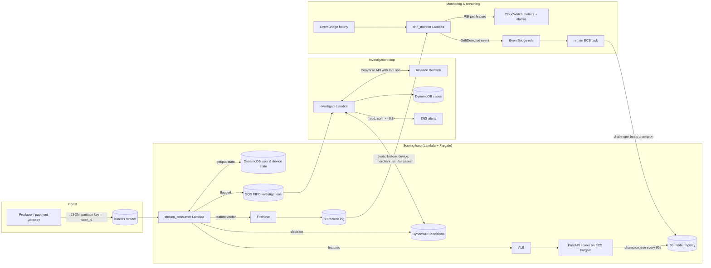

# Architecture

RADAR (Real-time Agentic Detection and Reporting) has three loops running at different speeds:

| loop | cadence | what it does |
|---|---|---|
| **scoring** | per transaction, < 100 ms | features from rolling state, model score, decision persisted, flagged ones queued |
| **investigation** | per flagged transaction, seconds | LLM agent gathers context with tools, commits a validated verdict, analyst report + alert |
| **monitoring & retraining** | hourly / on drift / weekly | PSI drift on live features, champion/challenger retrain, hot-swap promotion |

## Scoring path, step by step

1. **Producer** (`radar-produce`) replays `transactions.parquet` onto Kinesis. The wire record is
   the `Transaction` schema - no labels. Partition key is `user_id`, which gives per-user ordering.
2. **stream_consumer** reads a batch, and for each record:
   - loads `UserState` and `DeviceState` from DynamoDB (one `GetItem` each, consistent read),
   - computes the 45 features in `features/engineering.py` from the state *before* this transaction,
   - calls `POST /score` on the Fargate service (keep-alive HTTP client, 2 s timeout),
   - writes the decision (score, flag, SHAP reasons, feature vector, raw txn) to the decisions table
     with a 30-day TTL, and the feature vector to Firehose for drift monitoring,
   - if flagged, sends `{txn_id, user_id, score}` to the FIFO investigations queue,
   - folds the transaction into the state and writes it back.
   Failures are reported per record (`ReportBatchItemFailures`) with bisecting retries and an
   on-failure SQS destination, so one poison record cannot stall the shard.
3. **Scorer** keeps the champion `ModelBundle` in memory, polls `champion.json`'s ETag every 60 s
   and swaps the model without a redeploy. SHAP is computed only for flagged transactions
   (about 1% of traffic) to keep the median under a millisecond.

## Feature engineering without train/serve skew

The same `compute_features(txn, user_state, device_state, profile, merchant)` function runs in
training (replaying history through an in-memory store in time order) and in serving (DynamoDB
store). State is bounded (24 h recent window, capped sets) so a DynamoDB item stays small, and
every feature is causal: it only uses what was known before the transaction's timestamp.

Feature groups: amount vs the user's running mean/std (Welford), velocity (1 h / 24 h counts and
sums, sub-Rs100 count), device novelty and sharing (`device_user_age_days`,
`device_user_count`), geography (distance and implied speed since the previous transaction,
home-city, international), time of day in IST, static merchant risk prior and age, channel and
category one-hots.

## Investigation agent

`agent/investigator.py` runs a Bedrock Converse loop with seven tools. Six are read-only
look-ups over the decisions/state tables (the LLM never writes); the seventh, `submit_verdict`,
is the only way to finish and its payload is validated against `InvestigationResult`. Guardrails:
tool allow-list, pydantic validation of every argument, step and token budgets, bounce-back of
invalid verdicts, and `needs_review` as the fail-safe outcome. The heuristic backend drives the
same loop with a fixed plan and hand-written rules and is the baseline in `evals/`.

## Drift and retraining

At training time `reference.json` freezes decile bins for every feature and for the score. Every
hour the drift monitor bins the last 24 h of the feature log with the same edges and computes PSI
per feature; results go to CloudWatch (`RADAR/FeaturePSI`, `MaxPSI`) and, above 0.2, an
EventBridge `DriftDetected` event starts the retraining task. The task trains a challenger on the
latest window, evaluates the current champion on the same held-out window at the same target FPR,
and promotes only on a material recall gain without a PR-AUC regression. Every decision is written
to `models/decisions/` for audit.

## Why these services

| need | choice | alternative considered |
|---|---|---|
| ordered, replayable stream | Kinesis (1 shard = 1 MB/s in, 1000 rec/s) | MSK (Kafka): more ops, more cost for this scale |
| per-user state, ms reads | DynamoDB on-demand | ElastiCache Redis: lower latency but needs a VPC/NAT and no persistence by default |
| scoring service | Fargate + ALB | model inside the Lambda (supported via `RADAR_SCORER_URL=local`): fewer hops, but no independent scaling, no shared endpoint for synchronous callers |
| long-running training | ECS Fargate task | Lambda: 15-min limit; SageMaker: heavier and not free-tier friendly |
| LLM | Bedrock Converse | direct Anthropic API: fine, but Bedrock keeps data in-account and under IAM |
| infra | Terraform | CDK/SAM: fine too; Terraform is the common denominator across clouds |

Deeper rationale and rejected options: [decisions.md](decisions.md).
